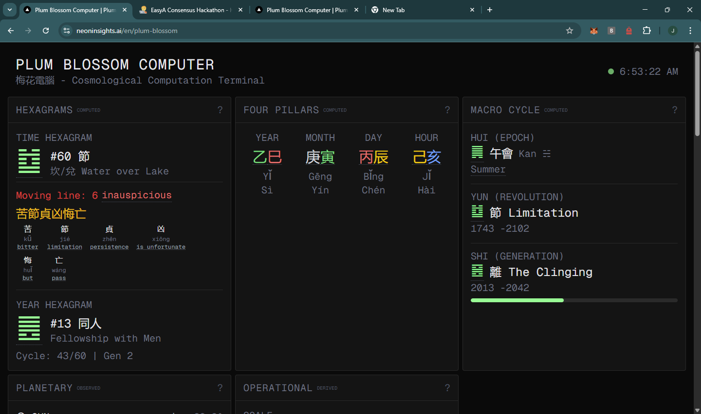
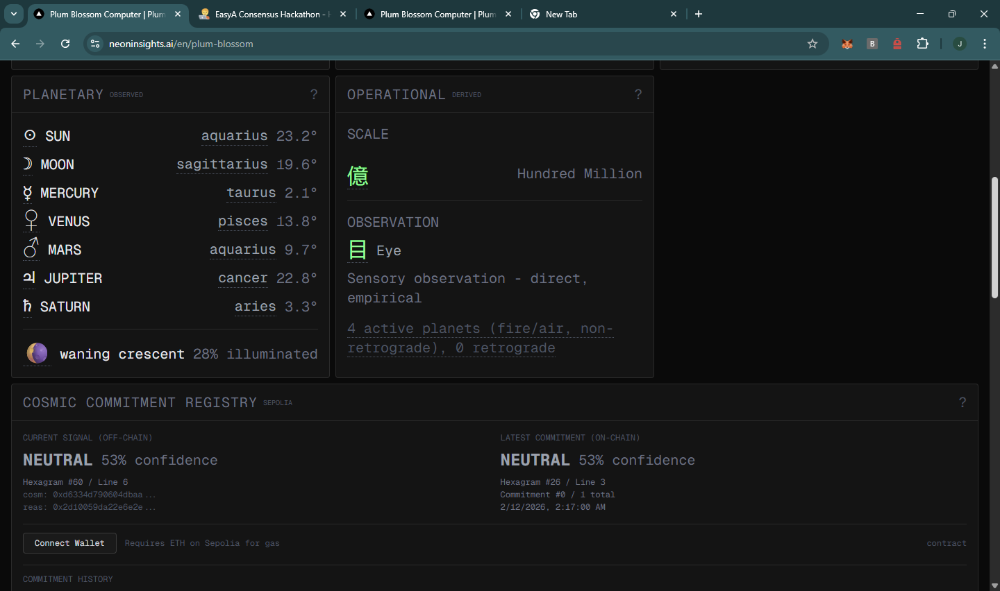
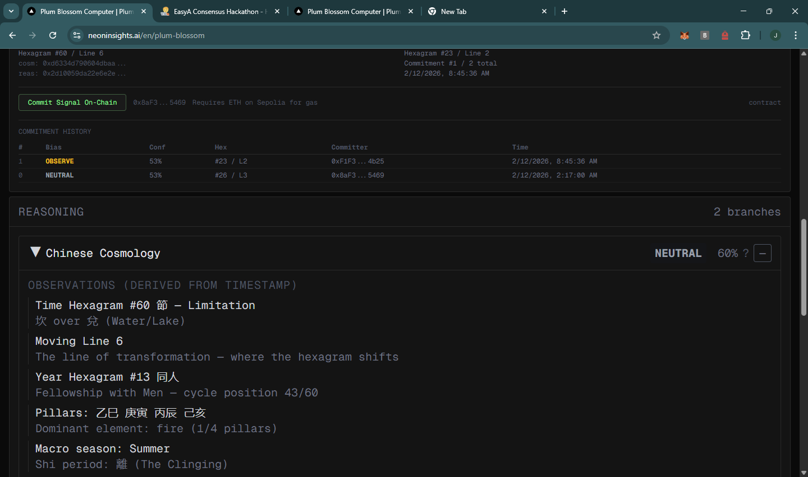
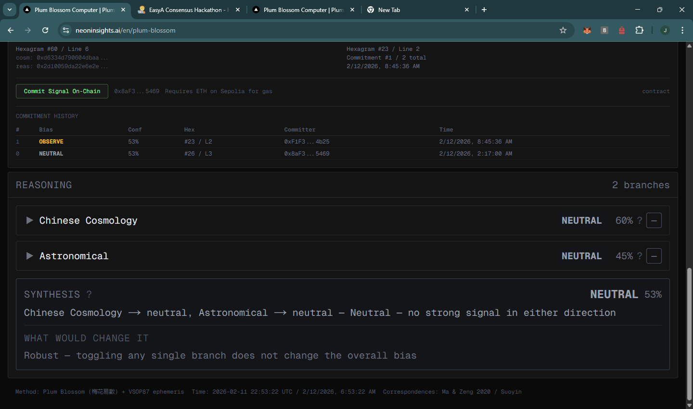
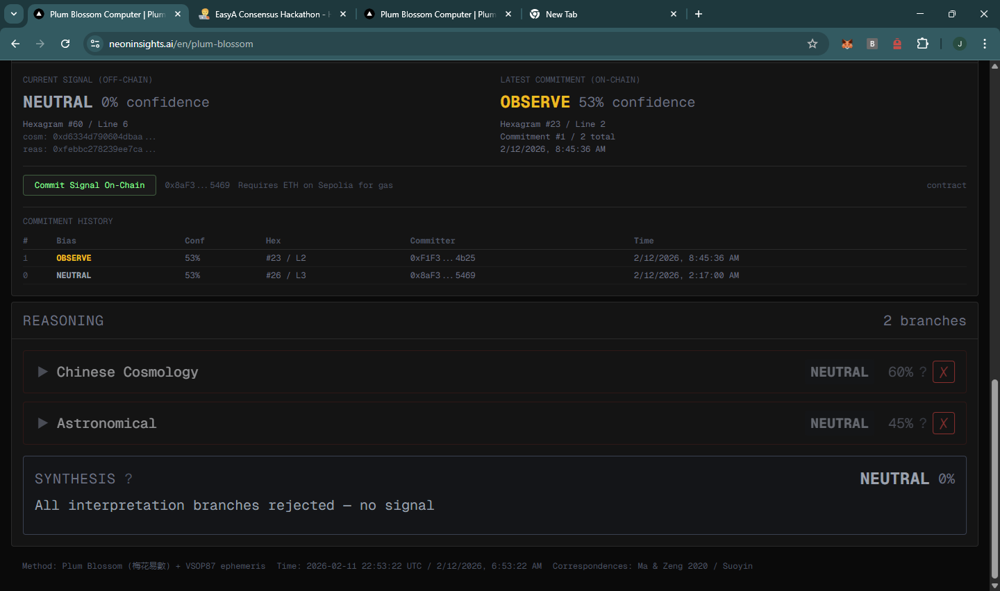

# Plum Blossom Computer (梅花電腦)

A Next.js app that synthesizes 1,000 years of Chinese cosmological mathematics with real-time astronomical data into an interactive reasoning dashboard — with cryptographic anchoring on Ethereum.

Built for EasyA x Consensus Hong Kong 2026.

**Demo:** https://youtu.be/iG5sE9tKiyo

**Smart Contract (Sepolia, verified):** [`0x86c3783e211b7FCfB93aEd47F0e030BFb4c85F77`](https://sepolia.etherscan.io/address/0x86c3783e211b7FCfB93aEd47F0e030BFb4c85F77#code)

**Submission post:** https://x.com/aug_digitalrain/status/2021638340521660540

**Pitch deck:** https://www.canva.com/design/DAHBCf72Ckc/YsiyO7eaTLVZFUoNHmyyrg/edit

## Screenshots


*Hexagram computation with interlinear gloss, Four Pillars stem-branch display, and Macro Cycle timeline*


*Real-time planetary positions, operational scale derivation, and on-chain commitment registry (Sepolia)*


*On-chain commitment history and expanded Chinese Cosmology reasoning branch with observations*


*Reasoning synthesis — Chinese Cosmology and Astronomical branches producing an overall bias signal*


*Users can reject reasoning branches — synthesis recomputes in real time without recalculating cosmology*

## What It Does

The Plum Blossom Computer runs a deterministic computation pipeline:

1. **Hexagrams** — Shao Yong's time-based method (時間起卦) using Prior Heaven trigram sequence
2. **Four Pillars** (四柱) — Year/month/day/hour stem-branch pillars from the lunar calendar
3. **Macro Cycles** — Shao Yong's 129,600-year cosmological framework (元會運世)
4. **Astronomy** — Real planetary positions and moon phase via VSOP87 ephemeris
5. **Operational Scale** — Observation level and scale derivation
6. **Reasoning Graph** — Two semantic branches (Chinese Cosmology + Astronomical) producing a bias signal: **act**, **observe**, **avoid**, or **neutral**

The output is fully reproducible — same timestamp, same result, every time.

## Cosmic Commitment Registry

The on-chain layer is a minimal smart contract that stores tamper-evident commitments of each computation. No oracle network — the computation is deterministic and client-reproducible.

When you click "Commit Signal On-Chain", the contract stores:
- `cosmologyHash` — keccak256 of the deterministic cosmology result
- `reasoningHash` — keccak256 of the reasoning synthesis
- Readable signal data (bias, confidence, hexagram #, moving line)
- Timestamps and committer address

Anyone can recompute with the same timestamp, hash the output, and verify it matches the on-chain commitment.

**Contract (Sepolia):** [`0x86c3783e211b7FCfB93aEd47F0e030BFb4c85F77`](https://sepolia.etherscan.io/address/0x86c3783e211b7FCfB93aEd47F0e030BFb4c85F77#code)

Ancient oracles relied on ritual to prevent revision. This one relies on cryptography.

## Quick Start

```bash
npm install
npm run dev          # http://localhost:3000
```

## On-Chain Deployment

### Prerequisites

- MetaMask or any EVM wallet
- Sepolia ETH for gas ([Google Cloud faucet](https://cloud.google.com/application/web3/faucet/ethereum/sepolia))

### Deploy the Contract

```bash
# 1. Create .env from template
cp .env.example .env

# 2. Add your mnemonic (or PRIVATE_KEY)
#    MNEMONIC="your twelve word seed phrase here"

# 3. Compile
npx hardhat compile

# 4. Deploy to Sepolia
SEPOLIA_RPC=https://ethereum-sepolia-rpc.publicnode.com npx hardhat run contracts/scripts/deploy.ts --network sepolia

# 5. Verify on Etherscan (optional, needs ETHERSCAN_API_KEY in .env)
SEPOLIA_RPC=https://ethereum-sepolia-rpc.publicnode.com npx hardhat verify --network sepolia <CONTRACT_ADDRESS>
```

### Configure the Frontend

Add the deployed contract address to `.env`:

```
NEXT_PUBLIC_REGISTRY_ADDRESS=<CONTRACT_ADDRESS>
```

For Vercel deployment, add `NEXT_PUBLIC_REGISTRY_ADDRESS` as an environment variable in the Vercel dashboard.

### Making a Commitment

1. Open the app and connect your wallet (MetaMask will switch to Sepolia automatically)
2. Click **"Commit Signal On-Chain"**
3. Sign the transaction — the contract stores the hashes and signal data
4. View on [Etherscan](https://sepolia.etherscan.io/address/0x86c3783e211b7FCfB93aEd47F0e030BFb4c85F77#readContract) via `getLatestCommitment()`

Anyone with Sepolia ETH can commit. Provenance is tracked by `msg.sender`.

## API

```
GET /api/oracle
```

Returns the current Plum Blossom Computer signal:

```json
{
  "bias": 2,
  "biasLabel": "observe",
  "confidence": 53,
  "hexagramNumber": 39,
  "movingLine": 1,
  "timestamp": 1770823546,
  "cosmologyHash": "0xab6a...",
  "reasoningHash": "0x7c54...",
  "algorithmVersion": "pbc-1.0.0"
}
```

## Commands

```bash
npm run dev          # Start dev server
npm run build        # Production build
npm run lint         # ESLint
npx hardhat compile  # Compile Solidity
```

## Architecture

```
src/
  app/
    api/oracle/          → GET endpoint returning signal + hashes
    [locale]/plum-blossom/
      PlumBlossomClient  → Main dashboard
      components/
        OraclePanel      → On-chain commitment UI
        HexagramCorePanel, StemsBranchesPanel, ...
  lib/
    plumBlossomComputer/ → Deterministic computation engine
    oracleHash.ts        → keccak256 hashing for on-chain commitments
    wallet.ts            → Wallet connection + contract interaction
contracts/
  CosmicCommitmentRegistry.sol  → On-chain commitment storage
  scripts/deploy.ts             → Hardhat deploy script
```

## Stack

- **Next.js 16** / React 19 / TypeScript
- **lunar-javascript** — Gregorian-Lunar conversion, stem/branch calculation
- **astronomy-engine** — Planetary positions, moon phase (VSOP87)
- **ethers.js** — Wallet connection, contract interaction
- **Hardhat** — Solidity compilation, deployment, verification
- **Tailwind CSS v4** — Styling
- **next-intl** — i18n (en/zh)
